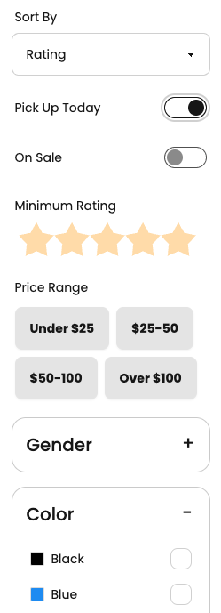

When building an app there's often a tradeoff between "approachable" features for most users
and "powerful" features for expert users. A good example of this is data filtering -- if your
app has listings with lots of different dimensions you want to expose all the options to
your users, but you don't want to overwhelm them. Let's say you're building a sportswear
ecommerce site with many different filter options:



Wouldn't it be great to offer your users the flexibility of a text search bar combined with the
fine-grained controls of a filter UI?

## The Goal: Query to Filter

I've already implemented a rich product filtering interface inside my Next.js app. The filters
that can be provided are expressed by this Zod schema:

```ts
// example enum, there are more
export const SizeEnum = z.enum(["XS", "S", "M", "L", "XL", "XXL"]);

export const FilterSchema = z
	.object({
		query: z
			.string()
			.describe("a full-text search query of the name and description of the product"),
		pickUpToday: z.boolean(),
		onSale: z.boolean(),
		gender: z.array(GenderEnum),
		color: z.array(ColorEnum),
		minRating: z.number().describe("on a scale of 0.0 - 5.0"),
		maxRating: z.number().describe("on a scale of 0.0 - 5.0"),
		minPrice: z.number().describe("in USD"),
		maxPrice: z.number().describe("in USD"),
		size: z.array(SizeEnum),
		brand: z.array(BrandEnum),
		activity: z.array(ActivityEnum),
		collection: z.array(CollectionEnum),
		features: z.array(FeatureEnum),
		technology: z.array(TechnologyEnum),
		fit: z.array(FitEnum),
		sort: SortEnum,
	})
	.partial();

export type Filter = z.infer<typeof FilterSchema>;
```

What I want to be able to do is add a simple text search bar that can translate a natural
language query, for example:

> shirt under $30 available for pickup

into a filter that matches my existing schema:

```json
{
  "query": "shirt",
  "pickUpToday": true,
  "maxPrice": 30
}
```

One of the most powerful capabilities of Large Language Models (LLMs) is their ability to turn
unstructured language into structured data. Given enough instruction, an LLM can understand
enough about a user's query to turn it into a structured query.

You may have heard of "Retrieval Augmented Generation" or RAG...well, this is sort of the
opposite! This is Generation Augmented Retrieval -- we're using Generative AI to help our
users perform a "traditional" query of our product listing.

## Tool Setup: Genkit and Gemini

To build our natural language filter we're going to use [Firebase Genkit](https://github.com/firebase/genkit).
Genkit is a library that makes it easy to add GenAI features to an application and provides a
standard API that works across many model providers. For this example we'll use Google's **Gemini 1.5 Flash**
model for its fast inference speed.

You can [follow the documentation](https://firebase.google.com/docs/genkit/nextjs) to initialize
Genkit in your app, or you can do it manually like so:

```bash
npm i \
  @genkit-ai/core \
  @genkit-ai/ai \
  @genkit-ai/flow \
  @genkit-ai/googleai \
  @genkit-ai/dotprompt
```

Once you've installed the packages, you'll need to configure Genkit with the Google AI plugin
(for access to the Gemini model) and the Dotprompt plugin (for the `.prompt` text prompt syntax):

```ts
import { configureGenkit } from "@genkit-ai/core";
import { dotprompt } from "@genkit-ai/dotprompt";
import { googleAI } from "@genkit-ai/googleai";

configureGenkit({
	plugins: [dotprompt({ dir: "./prompts" }), googleAI({ apiKey: "..." })],
});
```

You can get an API key from [Google AI Studio](https://aistudio.google.com).

## Writing the prompt

Genkit has built-in mechanisms for conforming output to a supplied schema,
and since I already have my schema in Zod this is even easier. Below my
`configureGenkit` block, I can register a named schema for use in my prompts:

```ts
import { defineSchema } from "@genkit-ai/core";
import { FilterSchema } from "./schema.js";

defineSchema('Filter', FilterSchema);
```

Next, I'll create the `prompts/productFilter.prompt` file. Genkit's Dotprompt
library lets me define both the content of my prompt as a rich template and
supply the metadata for my prompt (such as the model and output schema).

```handlebars wrap
---
model: googleai/gemini-1.5-flash
output:
  schema: Filter
---

You are helping a user filter through a selection of activewear products. Given the following query supplied by the user, convert their intent into the provided schema for a filter.

### Filtering Hints ###

- When a user says something like "best", sort by rating.
- When a user says something like "cheapest", sort by price.
- When a user says "popular", sort by popularity.
- Only include "query" if the other filters are inadequate.
{{#if existing}}

### Existing Filters ###

The user has requested a refinement to an existing set of filters. Use the existing filters as a starting point and make modifications to it. Existing filters:

{{json existing}}{{/if}}

### User-Supplied Query ###

{{query}}

### Output Instructions ###

Just supply the JSON without additional text or explanation. All fields are optional. Include only fields that are set to a non-null value.
```

A few things to note about the prompt:

- Since I've already initialized the `googleAI` plugin I can use the Gemini 1.5 Flash model by name.
- I don't need to describe the output schema in the prompt. Genkit takes care of that for me since I provided a named schema in the frontmatter of the prompt.
- If present, I provide the existing filter the user has selected (rendered as JSON) so that the LLM can refine a search as well as start from scratch.
- I've added hints to help the LLM understand specific scenarios that I ran into while testing. You should expect prompts to evolve over time as you run into edge cases. Including high-quality examples is another great way to improve quality.

## Integrating into the app

I'm using Next.js here, but Genkit can be used in any Node.js server environment.
First, I'll load and call my prompt as part of a Genkit *flow*, which you can think
of as a special kind of function wrapped with tracing and observability for GenAI:

```ts
import { defineFlow } from "@genkit-ai/flow";
import { prompt } from "@genkit-ai/dotprompt";
import { z } from "zod";
import { FilterSchema } from "./schema.js";

const magicFilterFlow = defineFlow({
  name: "magicFilter",
  inputSchema: z.object({
    query: z.string(),
    filter: FilterSchema.optional(),
  }),
  outputSchema: FilterSchema,
}, (input) => {
  const filterPrompt = prompt('productFilter');
  const result = await filterPrompt.generate({input});
  return result.output();
});
```

Now I can create a server action that executes the flow:

```ts
"use server"

import { runFlow } from "@genkit-ai/flow";
import { magicFilterFlow } from "./flow.js";
import { FilterSchema } from "./schema.js";
import { z } from "zod";

export function magicFilter(input: {
  query: string,
  filter: Filter
}): Filter {
  return runFlow(magicFilterFlow, input);
}
```

and, finally, I can call the server action from my client component:

```ts
const [filter, setFilter] = useState<Filter>({});
const [query, setQuery] = useState<string | null>(null);

function handleSubmit(e) {
  const newFilter = await magicFilter({query, filter});
  setFilter(newFilter);
}
```

## Wrapping up

There we have it! We've built an AI-powered natural language filter
that works on top of an existing search/filter mechanism without having
to reinvent everything from scratch. Bringing it into the app, it looks
like this:

<video autoplay loop muted playsinline src="/videos/magic_filter_demo.mp4"></video>

Is this perfect? Of course not. You'll find that some portion of the time
a query is misunderstood or a filter applied incorrectly. However the
stakes are low here: the user can always manually correct the LLM's mistake.

My favorite AI features are the ones that disappear into the application and
feel like a natural part of the interface. Everyone is familiar with a search
bar, but thanks to GenAI our search bar can directly manipulate a complex
interface by better understanding our users' intent.

The [full source code](https://github.com/mbleigh/genkitchen/tree/main/src/filter) of the demo application is available on GitHub.