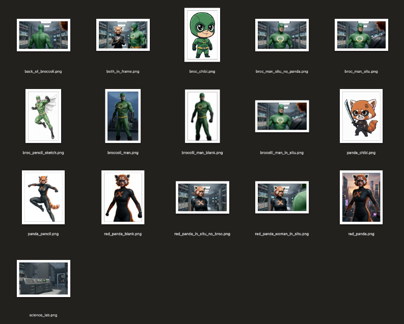
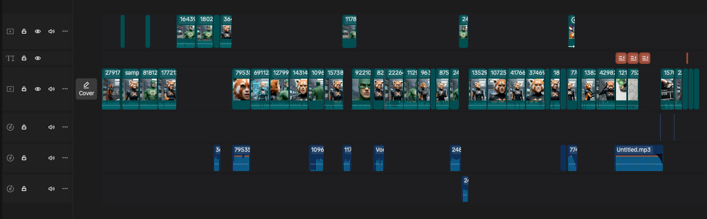

Within Google there is a series of videos starring "Broccoli Man" poking fun at the experience of building software as a Googler. One of these, ["I just want to serve 5TB"](https://www.youtube.com/watch?v=3t6L-FlfeaI), circulated extremely widely and ended up getting published publicly to YouTube. It's a Google cultural classic that still resonates 15 years later (though with *mostly* different specifics thwarting Googlers' ability to "just" do simple things).

On a recent Saturday I found myself in need of distraction and with some hours to spare. I had recently been reminded of the  Broccoli Man video and decided to recreate it using the latest and greatest AI technology available at Google.

I was pretty pleased with the result!

<iframe width="560" height="315" src="https://www.youtube.com/embed/IdgiL8qcGI0?si=dYGYjRsbxOxpVGWY" title="YouTube video player" frameborder="0" allow="accelerometer; autoplay; clipboard-write; encrypted-media; gyroscope; picture-in-picture; web-share" referrerpolicy="strict-origin-when-cross-origin" allowfullscreen></iframe>

Using Veo 3.1 and Nano Banana in a single day, I was able to create a 4-minute short film that has plenty of glitches and inconsistencies but I felt captured the spirit of the original.

So let's dive into how it was made...

## Making Broccoli Man Remastered

**Note:** I'm somewhere in the "prosumer" realm in terms of video production skillset. I've used plenty of creative tools (largely Adobe suite: Photoshop, Premiere, Illustrator) and have done video production as an occasional hobby for years, but never professionally and never very regularly.

### Overall Process

The total process, from idea to end product, was completed over a single Saturday. I'd estimate it was something like:

* **Script / Previz:** 30-45 minutes
* **Main Veo Production:** 3-4 hours
* **Post-production and Editing:** 2 hours

Tools used:

* [AI Studio](https://ai.studio) - script preparation
* [Magic Markup](https://magic-markup.mbleigh.dev/) - Nano Banana image editing
* [Vertex AI Studio](https://cloud.google.com/generative-ai-studio) - Veo video generation
* Veo 3.1 with "Ingredients to Scene" - all video generation
* [CapCut](https://www.capcut.com/) - editing and titles
* [Suno v5](https://help.suno.com/en/articles/8105153) - End credits music generation

### Preproduction

**Script / Veo Prompts.** I used [AI Studio](https://ai.studio) with YouTube attachment enabled to take the original video and break it down into a set of suggested 8 second scenes. I skimmed over these and did a few suggested passes to e.g. try to keep continuous dialogue within a single scene, add some cinematic angles, etc. This was mostly useful as a script organization and brainstorming exercise -- I ended up manually editing almost every prompt to match my own creative vision a bit better. [Here's a paste](https://gist.github.com/mbleigh/fac65a53efe81f315ee81b06570e0b94) of the final AI output. Unfortunately, I didn't keep track of the actual final prompts I used for each clip.

**Character Ingredients.** I used [Magic Markup](https://magic-markup.mbleigh.dev/) (my own vibe-coded [Genkit](https://genkit.dev/)-powered Nano Banana tool) to first convert screen grabs of Broccoli Man and Red Panda to photorealistic versions (this worked on the first try), then to remove the backgrounds from each. I also tried to do a more photorealistic background of the science lab / server room from the original video.

**Nano Banana Quick Tips**

* Do one thing at a time. Don't do something like "take out X and put Y in instead", instead do "take out X", then do "put Y in" as separate prompts.
* Remove backgrounds (use a plain white or green screen) when creating "ingredients" to use elsewhere. Otherwise you'll end up with "bleed-over" of background details from the reference image.
* You have way more control and way less latency with Nano Banana than Veo, so if there's a specific visual detail that has to be done right, get it as an image first.

Here's a screengrab of the various ingredients I created, though note that many of them were developed during production to fix specific issues I was having (more on that below).

### Production

Even though it's not the most full-featured, I ended up using Vertex AI Studio for clip generation. It made it easy to store the results to a bucket so I wouldn't lose them.

I started trying to generate the first clip with "ingredients to video" with the white-background Broccoli Man and Red Panda and science lab background. It took a few tries to get something I liked. My first scene included medium shots of both characters facing each other. To keep things consistent, I screen-grabbed these and used them instead of the blank slates for future scenes.

The overall process was very iterative. I always did 4 samples for each scene, and **this was super necessary**. Usually one or two "takes" were significantly better than the others. But oftentimes I needed to rethink the prompt or even the actual scene to "shoot" it properly with Veo. Of the ~25 scenes maybe 8-10 were "one shot" where I chose a final sample from the first try. For the rest, I would tweak the prompt or reshuffle dialogue between prompts until I was able to get something like what I wanted.

Because video generation took a while, I was also editing simultaneously and would sometimes start generation of two clips at the same time to keep things moving.

**Stuff that was easy**

* **Character Consistency.** Who would have thought, given that this was basically impossible even a year ago. But with "ingredients to video" I never had major issues. I'd occasionally get a bad roll where the masks were removed, but probably less than 20% of the time.

* **Voice consistency.** Might have just gotten lucky here but while Broccoli Man's voice would sometimes change in timbre or intonation a bit, they always sounded similar enough that at least one of the takes gave me usable audio.

* **Audio sync.** Surprisingly, oftentimes even if the visual "performances" were pretty different the length and intonation of words was close enough that I could intercut multiple video samples together while retaining lipsynced audio. I used this several times to take aspects of different "takes" I liked and blend them together.

**Stuff that was medium**

* **Multi-cut clips.** Sometimes instructing the model to "CUT TO" or annotating with rough timestamps was very successful. Other times it barely worked at all. No real pattern I could see as to when it would work or not.

**Stuff that was hard**

* **Duration.** Everything must be rendered in exactly 8 second increments. Sometimes I had longer lines that couldn't quite fit, sometimes I had short beats that became awkward when stretched to 8 seconds.

* **A single long conversation.** The "static" nature of the original video in many ways made it harder to recreate with AI. I couldn't rely on the "pretty demo" tactics of heavy action and constant movement. I had to come up with creative ways to keep things interesting without really having a lot of dynamic character movement.

  If I were doing this "in the real world" I might have experimented more with long-form dialogue lipsync models (like those from Runway or HeyGen) or other tools.

* **Blocking and Camera Control.** I could have probably done this better if I was willing to spend a lot more time building start frames with Nano Banana, but keeping the character positions consistent was difficult and keeping to the [180-degree rule](https://en.wikipedia.org/wiki/180-degree_rule) was more or less impossible given how long I wanted to spend on it.

  I'd love to have the ability to define the ingredients of a scene more completely and have some real control over camera motion and character blocking.

* **EMOTE, dammit, EMOTE\!** The character performances, especially voices, tend to bake out to a kind of "Veo neutral" that starts to feel flat during a long scene like this one. When I rolled a lucky seed and got a strong performance (like "Do you think your users are scum?") it was often "wonky" in other ways -- I did extra work to keep a take with a performance I liked. It made me appreciate how much actors bring to the table in a real movie!

* **Guardrails are a little tight.** The Broccoli Man video is not PG-rated but it's also not exactly a hard R. The model was not willing to let Red Panda say that she would play hopscotch with Broccoli Man's entrails.

* **Doing anything "fast".** Veo likes to take its time with camera moves, character motion, text appearing, etc. Even when prompting with "smash zoom" etc. I wasn't able to always get what I wanted without a lot of rerolls. Part of this feels like an extension of the "duration" challenge where if I needed a quick 1-2 second shot I couldn't always get it.

* **Specific character interactions.** Trying to get complex movements out of the characters was tough especially if it involved them directly interacting with each other. Trying to get the chibi anime sword slashing was *very* difficult because it combined this issue with guardrails and "doing anything fast".

### Postproduction

Since each clip took a couple minutes to generate, I was trying to progressively edit the video as I went. I generated the whole video more or less in order, with a few sidequests and backtracks here and there. The process basically went:

1. Generate videos
2. Play videos back in Vertex AI Studio
3. Download the best take(s) and import into CapCut
4. Evaluate shots "in situ" to see how they play
5. Go back to (1) if it's not quite working

**You absolutely need to learn non-linear video editing to successfully create a project like this.** This is not something that could have worked just trying to append a sequence of AI-generated clips together. here's a screenshot of my final CapCut timeline:

It's pretty simple as far as editor timelines go, but:

* Nearly every scene has some trimming done to its start or end.
* Every time you see stuff in the upper track, that was me interleaving different takes.
* Every time you see audio track, that was me pulling out the audio to edit, intercut, or otherwise manipulate.
* There is no substitute for intentional timing and composition. The blooper reel, for example, is not at all funny without very specific editing.
* Dialogue volume was inconsistent so I needed to do a loudness normalization pass over the whole video.

## So, is it slop?

I love movies. I love filmmaking and filmmakers. I also love technology and new tools for creativity. I'm under no illusion that what I've made is cinema, and I am not the kind of person who thinks AI will replace actors blah blah blah. But I am glad these tools exist, because this video wouldn't exist without AI.

In no world would I ever have put together a real cast and crew to remake a 15 year old inside joke video for Googlers, but I was able to make it with AI. It was fun to make and provided some chuckles for many Googlers who remembered the original (and introduced the gem that is Broccoli Man to many more).

I think what gets lost in a lot of the AI media discussion is that intent matters. I find auto-generated slop-farm TikToks just as dystopic as the most fervent doomer, but I also remember when I was a 10-year-old kid making movies with my parents VHS camcorder and how much **fun** I would have had being creative if I'd had tools like this.

Technology is an amplifier. It can amplify the simple joy of creativity or it can amplify the cynical greed of a content farm. I believe we'll always find ways to value creativity and human effort even if the specifics evolve.
