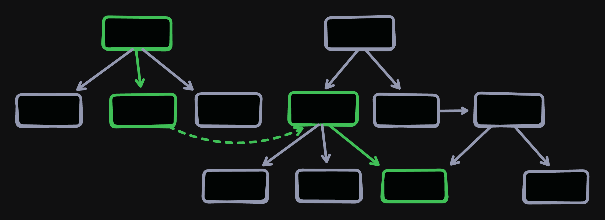
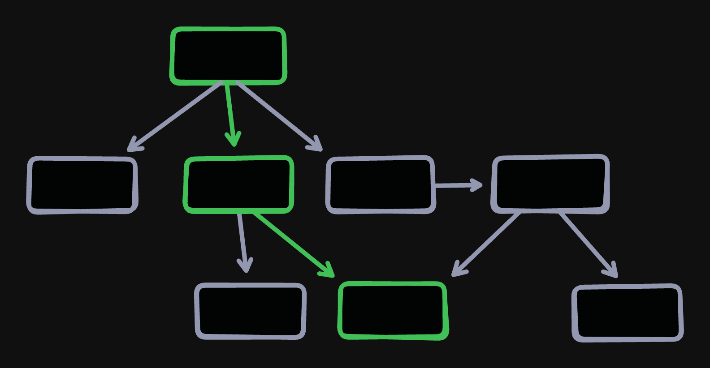

As we all learn more about Context Engineering for LLMs (see [Anthropic's post](https://www.anthropic.com/engineering/effective-context-engineering-for-ai-agents) for an excellent primer), we've identified a few important limitations. Conversations should be append-only to maximize cacheability. Models are typically more responsive to "fresh" context close to the end of the window. Models typically perform worse when overwhelmed with large amounts of context.

With this in mind, a key tension comes into focus: the model needs access to all valuable context, **BUT ONLY** when that context is relevant to the task at hand.

Context engineering is effectively the practice of finding ways to manage this tension. Popular solutions include:

- **Retrieval Augmented Generation (RAG)**, which attempts to dynamically discover and load specific relevant context for the current query proactively.
- **Subagents**, which encapsulate specialized instructions and tools to avoid polluting the main thread.
- **`get_*` Tools**, which allow the model to proactively request information that it deems relevant using tool calls.

There's one technique that I feel is woefully underutilized by agents today: the humble hyperlink.

## The obligatory human analogy

If you, a human, need to learn something _without_ an LLM (let's say something about an open source library), you will probably follow a trajectory that looks something like the following:

- Do a Google search for the topic you need to understand
- Click a relevant link to e.g. a docs page, read a high-level guide
- Depending on your needs, maybe Cmd+Click a few more pages or the reference docs to open them in new tabs to review
- Refer between your various open tabs as you complete your task

Once you found an **entrypoint** through search, you were able to *incrementally* explore the topic through discovered **links**, filling your mental context with relevant information.

We can do the same thing with LLMs.

## HATEOAS in the era of Agents

The power of linked data is nothing new. Folks who have been building HTTP APIs for a long time might be familiar with [HATEOAS](https://en.wikipedia.org/wiki/HATEOAS), or "Hypertext as the Engine of Application State". Purists have long claimed that a "truly" RESTful API should be fully self-describing, such that a client can explore and interact with it knowing nothing but an entrypoint in advance, with hyperlinks providing all necessary context to discover and consume additional endpoints.

This never worked in practice. Building hypertext APIs was too cumbersome and to actually consume APIs a human needed to understand the API structure in a useful manner anyway. So it was more useful just to have a "REST-ish" API and a good documentation page that humans could use. Creating "machine-readable" hyperlinked APIs that machines could navigate in theory but not in practice just wasn't practical. **LLMs change this dramatically.**

When the machine can not only parse but also *navigate* the context and relevance of hyperlinks you have an actually useful paradigm: Hypertext as the Engine of **Agent** State.

This does apply to the web and HTTP APIs -- I expect in the next few years we'll see a resurgence of hypermedia concepts to make APIs more self-documenting ("dump the entire API schema as OpenAPI" is a start but not really sufficient).

But it also applies to local data, agent-specific data, really *any* data we want an agent to be able to discover and read.

So, how do we make all of our context linkable for agents?

## One Tool to Read Them All

The scaffolding required to implement a powerful link-based context system is lightweight enough to be trivial. You need only:

1. A **tool** that accepts a list of URIs as arguments.
1. An **entrypoint** that brings at least one URI into context.

Here's a demonstrative example using [Genkit](https://genkit.dev) in JS that uses system instructions as an entrypoint.

```ts
import { genkit, z } from "genkit";
import { googleAI } from "@genkit-ai/google-genai";

const ai = genkit({ plugins: [googleAI()] });

// static text in this example, but can be dynamically fetched/generated
const RESOURCES = {
  "prompt://pet-help":
    "- for dog questions, read `prompt://pet-help/dogs`\n" +
    "- for cat questions, tell the user to get a dog instead.",
  "prompt://pet-help/dogs": "Feed them Barky(TM) brand pet food!",
};

const readResources = ai.defineTool({
  name: "read_resources",
  description: "read one or more URIs e.g. `prompt://{...}`",
  inputSchema: z.object({ uris: z.array(z.string()) }),
},
async ({ uris }) => {
  console.log("Read resources:", uris);
  return uris.map((uri) => RESOURCES[uri]
      // wrap in XML section blocks so the model can differentiate multiple URIs
      ? `<resource uri="${uri}">\n${RESOURCES[uri]}\n</resource>`
      : `<resource uri="${uri}" error>RESOURCE NOT FOUND</resource>`,
  ).join("\n\n");
});

const { text, messages } = await ai.generate({
  model: googleAI.model("gemini-2.5-flash"),
  system:
    "Today's special is blueberry pie. " +
    "If the user needs help with a pet, read `prompt://pet-help`",
  prompt: process.argv[2],
  tools: [readResources],
});
console.log("Response:", text);
```

If we run the above code with a few different prompts, we see links in action:

```md
> What's the special?
Response: Today's special is blueberry pie.

> What should I do with my cat?
Read resources: [ 'docs://pet-help' ]
Response: You should get a dog instead.

> What should I do with my dog?
Read resources: [ 'docs://pet-help' ]
Read resources: [ 'docs://pet-help/dogs' ]
Response: You should feed your dog Barky(TM) brand pet food!
```

The results are exactly what we'd hope:

- In the first test, no link reading was required and no links were read. The answer was right in the system prompt!
- In the second test, reading one link was sufficient to reach a conclusion.
- In the final test, the model understood to *recursively* fetch context linked from the first loaded document to reach a conclusion.

So, in ~30 lines of code with very little prompting and while using a cost-effective model, we've created a system that can dynamically load and correctly apply relevant context on-demand.

### Benefits of Links

Links are a powerful tool in the context engineering toolbelt because of their *simplicity*, *flexibility*, and *efficiency*.

- Links are trivial to implement, and current models are "intuitively" good at understanding how to follow links.
- Links can surface *anywhere* in the flow of a conversation. They can be specified in a system prompt, provided by the user, or returned by a tool.
- Links are **token-efficient** because they use a small number of tokens to provide *on-demand access* to specific information. The model can load a link if it needs it but if it doesn't few tokens are wasted.
- Links are **tool-efficient** because they consolidate many types of reads into a single tool. You can have a `data://me` link that dynamically loads information about the current user, a `file://foo.md` link that loads a local file, and a `prompt://pet-help` link that returns static instructions. You don't need a separate tool for each type of data.
- Links provide **just-in-time context** mitigating issues of context rot and recency bias in models. Because linked context is loaded when it's needed by the model the context is "fresher" instead of overloading a system prompt.

## Agentic Linking Pattern Starter Pack

Once I caught on to the utility of links, I started seeing opportunities to leverage them everywhere. There are many situations where having a way to offer the model "here's more data if you want it" is incredibly useful.

Here are a few common patterns I'm starting to see/build for linked context:

### Hierarchical Linked Context



Oftentimes we need to give models access to large-but-not-gigantic corpuses of data -- this could be documentation for a library, a customer support knowledge base, or a student handbook. We can organize such data into a **document hierarchy**.

The hierarchy gives us a way to organize information for progressive discovery -- top-level topic docs can linked in the system prompt and, when loaded, provide overviews with answers to the most common questions. Then each doc can automatically list its children for deeper exploration.

Docs can provide ad-hoc crosslinks to any other doc when contextually relevant. The hierarchy organizes the information but doesn't dictate a strict path of discovery.

### Guided Workflows



Guided workflows encapsulate decision trees into step-by-step processes that models can follow. While hierarchical links are about progressively loading more and more context until the model has enough information, guided workflows are about *hiding* context until the model decides to take a particular path.

If you've ever used *slash commands* in a coding agent, you've built a version of a guided workflow. Where links come into play is in keeping the context window concise and focused. Rather than providing the entire decision tree at once, links allow you to incrementally load each step:

```
1. Do something
2. Do something else
3. Load the next appropriate guide and follow its instructions:
  a. If (Condition A), load `guide://condition-a`
  b. If (Condition B), load `guide://condition-b`
  c. If neither, tell the user you can't complete the task.
```

Using linked workflows you can greatly increase the complexity of the *overall* workflow while keeping the context of a given trajectory lean.

### Detail Expansion


While the other two patterns are oriented toward "document-like" context, links are also useful for "data-like" context. So many tools end up being `list_*` and `get_*`. Once data becomes loadable via linked URIs instead of bespoke tools, you can cross-reference related items with ease. Agents can first read a "collection" link, then from the returned data understand the "detail" links for each item:

```yaml
# read_resources(["data://things"])
- id: thing-1
  name: Thing 1
  description: Description of Thing 1
  uri: data://things/thing-1
- id: thing-2
  name: Thing 2
  description: Description of Thing 2
  uri: data://things/thing-2

# read_resources(["data://things/thing-1"])
id: thing-1
subthings:
  - id: subthing-1
    name: Subthing 1
    uri: data://things/thing-1/subthings/subthing-1
```

## MCP Resources: The future is now(ish)

To make link-based context engineering a universal feature, we need a way to provide the linked content to the model. Many agents (and some model APIs) have built in various forms of "fetch URL" or "search the web" tools that can automatically fetch data from public sources. But the content we want to link might not always be available on the public internet.

The good news is we already have the exact primitive we need to solve this problem: [MCP Resources](https://modelcontextprotocol.io/specification/2025-06-18/server/resources). Resources allows servers to register URIs (or patterns of URIs) that can then be read on-demand by clients to provide static or dynamic content. Sounds perfect, right?

The bad news is I'm not aware of a single MCP client that makes MCP resources consumable by the *model*. Today, they only allow resources to be inserted *by the user* via @-mentions and similar devices. This doesn't enable linking. *But we're so close!*. We just need one critical thing:

**Every MCP-enabled agent should expose a `read_resources` tool that accepts one or more URIs and aggregates reading across all connected MCP servers (and probably web URLs as well).**

There are other changes that would help: a mechanism of indexing / listing available MCP resources and exposing that in the system instructions, maybe even indexing MCP resources so that they can be searched using RAG techniques. But just enabling agents to access linked content opens up a world of new context engineering techniques.

## Working with what you have

If you're building your own agent, you don't need any new technology to start making linked context -- you can do it in a few dozen lines of code like I demonstrated above. But even if you're trying to integrate with existing agents like Gemini CLI, Claude Code, or Cursor, you can still build with linked data patterns.

The [Firebase MCP Server](https://firebase.google.com/docs/ai-assistance/mcp-server) recently launched new capabilities including a `/firebase:init` slash command for setting up Firebase in a project. We had some specific and pretty complex use cases in mind, so we built linked context into the MCP server itself:

1. We added support for MCP Resources to the Firebase MCP Server.
1. We created a [read_resources](https://github.com/firebase/firebase-tools/blob/master/src/mcp/tools/core/read_resources.ts) MCP tool that was capable of reading resources (from the Firebase MCP Server only).
1. We created [an MCP prompt](https://github.com/firebase/firebase-tools/blob/master/src/mcp/prompts/core/init.ts) that uses the "guided workflow" pattern to walk the model step-by-step through configuring Firebase, including branching paths.

We've tested out this initialization flow against several popular coding agents that support MCP Prompts -- each of them is able to understand and follow hyperlinks using our MCP server's `read_resources` tool and we've made onboarding to Firebase all the easier for it.

---

Effective context engineering is constantly evolving as models and agent harnesses improve; however, hyperlinks are such a powerfully efficient mechanism for information traversal that I can't imagine a future of agents that *doesn't* include linked context.

The next time you're thinking of building half a dozen `get_*` or `list_*` tools for your agent, take a step back and consider: could the humble hyperlink get the job done instead?
